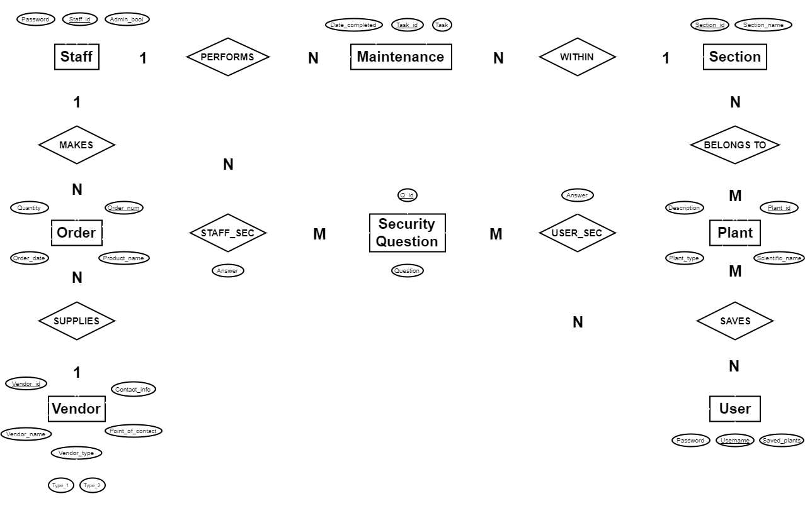
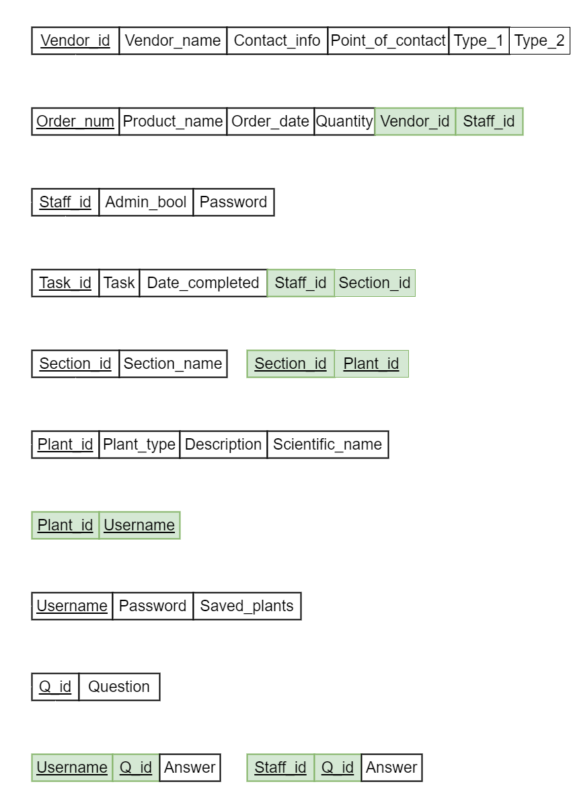

# Hahn DBMS

    Relational Database Management Project for Intro to Database Management Course.

# Table of Contents

- [Hahn DBMS](#hahn-dbms)
- [Table of Contents](#table-of-contents)
- [Introduction](#introduction)
  - [Developers](#developers)
  - [Purpose](#purpose)
- [Technologies](#technologies)
  - [MySQL](#mysql)
  - [XAMPP](#xampp)
- [Project](#project)
  - [Project Proposal](#project-proposal)
  - [ER Diagram Report](#er-diagram-report)
  - [Project Relational Schema Report](#project-relational-schema-report)
  - [Project Phase 1](#project-phase-1)
  - [Project Final Phase](#project-final-phase)
    - [User Support](#user-support)
    - [System Functionality](#system-functionality)
    - [Reporting Facility](#reporting-facility)
    - [GUI](#gui)

# Introduction

- The Hahn Database Management System is a Relational DBMS Project completed as a part of coursework for Intro to Database Management Systems.

## Developers

- Emaan Rana
- Micah Moore
- Shannon-Kate Barrett Johnson

## Purpose

- The system itself was inspired by the need for a way to manage garden related tasks for the Hahn Horticulture Garden at Virginia Tech such as performing CRUD (Create, Read, Update, Delete) operations on:
  - Plants
  - Sections
  - Maintenance
  - Vendors

# Technologies

- For our project, we made use of MySQL for the database and XAMPP for the interface.

## MySQL

- MySQL is an open-source relational database management system (RDBMS).

## XAMPP

- XAMPP is a free and open-source cross-platform web server solution stack package developed by Apache Friends, consisting mainly of:
  - Apache HTTP Server
  - MariaDB Database
  - PHP
  - Perl
- In our case we used MySQL instead of MariaDB for the database of this project.

# Project

- The project itself was completed incrementally over five project phases that included creating detailed Entity-Relationship Diagrams and Project Relational Scehma.

## Project Proposal

- During this phase, we proposed our system as well as the 2-4 different kinds of users that may want to use it and what functionalities each of them would require.
- We then presented a list of 10-15 real-world entities that should be present in the system.

## ER Diagram Report

- During this phase, we identified the database entities and the relationships between them by thinking about the real-world model of our system.
- After making these identifications, we then drew our "Entity-Relationship" Diagram (ER Diagram).
- Having a good, clear and well-defined ER Diagram made creating tables easier throughout the duration of the project.
- The report itself includes:
  1. Problem Definition
  2. List of System Users and respective Privileges
  3. List of Entities with brief Descriptions
     - Describing what the entity represents in the DB rather than actual attributes.
  4. List of Relationships and brief Descriptions
  5. ER Diagram
     - Entities
     - Attributes of each Entity
     - Relationships between all Entities

    

## Project Relational Schema Report

- This phase required a revised/corrected version of the ER Diagram from the previous phase.
- ER Diagram is mapped into Database Relations using [Textbook](https://docs.ccsu.edu/curriculumsheets/ChadTest.pdf) Algorithm to simplify and remedy redundancy of DBMS.
- Shows Primary and Foreign Keys.
- The completed Project Relational Schema report included:
  1. New Corrected ER Diagram
  2. A Complete Relational Schema Diagram
     - Database Relations showing Primary Keys
     - Foreign Keys showing the Referenced Relations (Denoted by Arrows)
  3. Any Database Constraints

    

## Project Phase 1

- During this project phase, construction of the actual database took place using some DBMS of choice.
  - In our case, we used MySQL.
- All tables were built and all table attributes were added with reasonable associated data types.
- All primary keys and foreign keys set up properly.
- Required to build at least 20 tuples in major tables.

## Project Final Phase

- During this phase, DB Schema was actually connected to interface of choice.
  - In our case, we used XAMPP.
- The final product met the following requirements:

### User Support

- Different types of users supported by our application.
- No hardcoded passwords.
- User data stored in DB table.
- Each individual has a username and password.
- Application enables sign up, login, logout, and change password functionality.
- Only first admin user can be created manually after which they should be able to change their password.
- Admin should be able to create other admins through the application.
- Passwords need to be encyrpted.

### System Functionality

- All access to data done via application.
- No direct access to a datatable is allowed.
  - That is, all CRUD operations occur via the application itself.

### Reporting Facility

- Statistical reports depending on needs of our application.
- Material level reports to see some overall statistics of the whole application.

### GUI

- Do not expect users to be database programmers.
- Do not expect users to memorize IDs.
  - Use usernames instead of IDs for the user.
  - That is, the ID is abstracted from the user in the form of a username instead.
- Interface should be operation-oriented.
  - Categorize user interface with respect to functionalities that need to be supported rather than tables to be accessed.